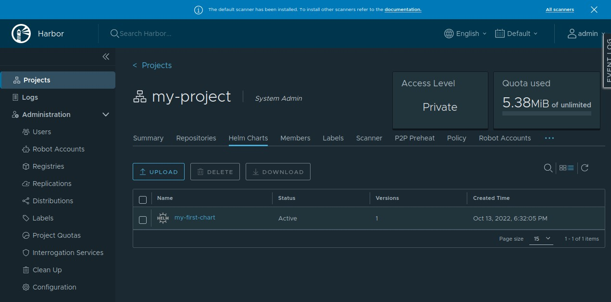

# Kubernetes üzerinde helm kullanarak Harbor Registry kurulumu

## Giriş
<br>

Merhabalar bu yazımda size Kubernetes üzerinde çalışacak şekilde Harbor Registry kurulumunu anlatmaya çalışacağım. Öncelikle bir kaç ön bilgi vermekte fayda var diye düşünüyorum.

<br>

## Harbor Nedir?

Harbor container imajlarınızı saklayabileceğiniz, dockerhub'a alternatif olarak da düşünebilieceğiniz bir üründür. İmajlarınızı dockerhub'a pushlarmak yerine kendi yönettiğiniz sunucucularınızda kuracağınız bir registry sunucusu kullanarak hem docker/kubernetes ortamlarınızın internete çıkmadan kendi lokal ağınızdaki bu sunucu ile iletişim kurarak hem dosya indirme boyutu hem de indirme süresi gibi değişkenleri azaltabilirsiniz.

Bu yazıda Harbor kurulumunu kubernetes ortamında gerçekleştireceğim.

<br>

Kurulum için ihtiyacım olanlar;

- Kubernetes Cluster 
- Helm
- Harbor'un imajları saklaması için bir persistent volume

<br>

# Helm Nedir?

Helm kubernetes tarafında uygulamalar kurmak ve yönetmek için bir paket yöneticisidir, Kubernetes tarafında uygulama kurmak için YAML formatında yazılmış Kubernetes Manifestosu diye adlandırılan dosyalar kullanıyoruz. Bu dosyaları kubernetes komut satiri araci olan ```kubectl``` kullanarak Kubernetes API'sine göndererek Kubernetes tarafında çeşitli objeler (deployment, volume, configmap, secret vs.) yaratılmasını sağlarız.

Bu dosyaları elle/editör kullanarak yönetebiliriz ancak aynı ürünü birden fazla proje ya da ortama kurmak istediğimizde bu dosya içindeki değişken bilgileri yönetmek (bu dosyaları kopyalamak, rename ederek içindeki bilgileri degistirerek) zor olabilir, işte tam burada helm yardımımıza yetişiyor. Helm chart denen ve aslında her biri birer template olan dosyalar kullanarak birden fazla proje ya da ortam için kullanılabilir hale getiriyoruz. Ve sonrasında helm paketi içinde yer alan ```values.yaml``` isimli bir dosyada bu değişken değerleri belirterek her farklı değerlere sahip olan ortamların kurulumunu gerçekleştiriyoruz. Yani chart'ı parametrik hale getirmiş oluyoruz. Oluşturduğumuz bu paketleri bir sunucudan sunarak (bir webserver kullanarak yada artifact repository denen repolarda tutarak) farklı ortamlara kolayca indirilebilir hale getiriyoruz. 

Ayrıca bu yazıda örnek bir helm chart olusturarak bu chart'i da kuracagimiz Harbor repository'sine push ederek burrdan sunma işlemini de gerceklestirecegiz.


# Persistent Volume nedir? 

Containerlar stateless ortamlardır, yani bu ortamlarda uygulama calisirken üretilen datalar container öldüğünde kaybolur. Önemli datalarımız böyle bir şekilde kaybolmasın istersek bu dataları Persistent Volume denen objeler yaratarak bu objeleri dosya sistemine bağlayip container'i bu şekilde çalıştırmamız gerekiyor. Böyle yaptığımızda, ilgili container ölse bile yerine calisan container datalari yine ayni klasorde görecegi icin uygulamanız kaldigi yerden devam edecektir. 
Ben PersistentVolume yaratmak için ```Portworx``` kullanacağım, farklı bir storage çözümü kullanıyorsanız siz de ona göre farklı bir ```StorageClass``` berlirtebilirsiniz. Portworx hakkında bilgi ve kurulum dökümanına asagidaki linkten ulasabilirsiniz. 
<br>

[MNM Technoloji'de Portworx kullanımı](https://medium.com/@mnmtech/portworx-deploy-kubernetes-1-25-2-eb5ce32f6696)

<br>
# Kurulum 

Ben Harbor'u bitnami helm reposundaki chart'ı kullanarak kuracağım, ben hiç kullanmadım ama siz isterseniz harbor'un official chart'ını da kullanabilirsiniz. Ancak ben bitnami chart ve imajlarını çok beğendiğim ve diger ihtiyaclarim (nginx, mariadb, redis vs.) icin de kullandigimdan dolayi helm ile deploy edecek bir ürün ihtiyacım oldgunda ilk olarak bitnami repository'sini ziyaret ediyorum. Size de tavsiye ederim.

Bitnami Helm Reposu: 
https://github.com/bitnami/charts/tree/master/bitnami/harbor
https://bitnami.com/stack/harbor/helm

Harbor Official Helm Reposu: 
https://github.com/goharbor/harbor-helm


---

### Şimdi gelelim kurulum adımlarına

Öncelikle bitnami reposunu helm'e ekliyoruz;

```
[root@kemo-test harbor]# helm repo add bitnami https://charts.bitnami.com/bitnami
"bitnami" has been added to your repositories
```

repo'yu update ediyoruz:
```
[root@kemo-test harbor]# helm repo update
Hang tight while we grab the latest from your chart repositories...
...Successfully got an update from the "bitnami" chart repository
Update Complete. ⎈Happy Helming!⎈
```

harbor chartını aratıyoruz
```
[root@kemo-test harbor]# helm search repo harbor
NAME                    	CHART VERSION	APP VERSION	DESCRIPTION                                       
bitnami/harbor          	15.2.5       	2.6.1      	Harbor is an open source trusted cloud-native r...
```

bitnami diye arattığınızda ise bitnami tarafında bir çok populer yazilima ait chartların oldugnuu görebilirsiniz.

```
[root@kemo-test harbor]# helm search repo bitnami| grep -v DEPRECATED
NAME                                        	CHART VERSION	APP VERSION  	DESCRIPTION                                       
bitnami/airflow                             	13.1.6       	2.3.4        	Apache Airflow is a tool to express and execute...
bitnami/apache                              	9.2.5        	2.4.54       	Apache HTTP Server is an open-source HTTP serve...
bitnami/argo-cd                             	4.2.3        	2.4.14       	Argo CD is a continuous delivery tool for Kuber...
bitnami/argo-workflows                      	3.0.4        	3.4.1        	Argo Workflows is meant to orchestrate Kubernet...
bitnami/aspnet-core                         	3.5.4        	6.0.9        	ASP.NET Core is an open-source framework for we...
bitnami/cassandra                           	9.7.2        	4.0.6        	Apache Cassandra is an open source distributed ...
bitnami/cert-manager                        	0.8.5        	1.9.1        	Cert Manager is a Kubernetes add-on to automate...
bitnami/clickhouse                          	0.2.3        	22.8.6       	ClickHouse is an open-source column-oriented OL...
bitnami/common                              	2.0.3        	2.0.3        	A Library Helm Chart for grouping common logic ...
bitnami/concourse                           	1.5.2        	7.8.2        	Concourse is an automation system written in Go...
bitnami/consul                              	10.9.2       	1.13.2       	HashiCorp Consul is a tool for discovering and ...
bitnami/contour                             	9.1.6        	1.22.1       	Contour is an open source Kubernetes ingress co...
bitnami/contour-operator                    	2.1.6        	1.22.1       	The Contour Operator extends the Kubernetes API...
bitnami/discourse                           	8.1.8        	2.8.9        	Discourse is an open source discussion platform...
bitnami/dokuwiki                            	13.1.5       	20220731.1.0 	DokuWiki is a standards-compliant wiki optimize...
bitnami/drupal                              	12.5.8       	9.4.8        	Drupal is one of the most versatile open source...
bitnami/ejbca                               	6.3.6        	7.9.0-2      	EJBCA is an enterprise class PKI Certificate Au...
bitnami/elasticsearch                       	19.4.2       	8.4.2        	Elasticsearch is a distributed search and analy...
bitnami/etcd                                	8.5.5        	3.5.5        	etcd is a distributed key-value store designed ...
bitnami/external-dns                        	6.10.2       	0.12.2       	ExternalDNS is a Kubernetes addon that configur...
bitnami/fluentd                             	5.5.3        	1.15.2       	Fluentd collects events from various data sourc...
bitnami/geode                               	1.1.4        	1.15.0       	Apache Geode is a data management platform that...
bitnami/ghost                               	19.1.19      	5.18.0       	Ghost is an open source publishing platform des...
bitnami/grafana                             	8.2.11       	9.1.7        	Grafana is an open source metric analytics and ...
bitnami/grafana-loki                        	2.4.5        	2.6.1        	Grafana Loki is a horizontally scalable, highly...
bitnami/grafana-operator                    	2.7.7        	4.7.0        	Grafana Operator is a Kubernetes operator that ...
bitnami/grafana-tempo                       	1.4.3        	1.5.0        	Grafana Tempo is a distributed tracing system t...
bitnami/haproxy                             	0.5.5        	2.6.6        	HAProxy is a TCP proxy and a HTTP reverse proxy...
bitnami/haproxy-intel                       	0.2.6        	2.6.6        	HAProxy is a high-performance, open-source load...
bitnami/harbor                              	15.2.5       	2.6.1        	Harbor is an open source trusted cloud-native r...
bitnami/influxdb                            	5.4.6        	2.4.0        	InfluxDB(TM) is an open source time-series data...
bitnami/jasperreports                       	14.3.4       	8.1.0        	JasperReports Server is a stand-alone and embed...
bitnami/jenkins                             	11.0.6       	2.361.2      	Jenkins is an open source Continuous Integratio...
bitnami/joomla                              	13.3.7       	4.2.3        	Joomla! is an award winning open source CMS pla...
bitnami/jupyterhub                          	2.0.1        	3.0.0        	JupyterHub brings the power of notebooks to gro...
bitnami/kafka                               	19.0.0       	3.3.1        	Apache Kafka is a distributed streaming platfor...
bitnami/keycloak                            	10.1.4       	19.0.2       	Keycloak is a high performance Java-based ident...
bitnami/kiam                                	1.1.4        	4.2.0        	kiam is a proxy that captures AWS Metadata API ...
bitnami/kibana                              	10.2.5       	8.4.2        	Kibana is an open source, browser based analyti...
bitnami/kong                                	7.0.0        	3.0.0        	Kong is an open source Microservice API gateway...
bitnami/kube-prometheus                     	8.1.10       	0.60.0       	Prometheus Operator provides easy monitoring de...
bitnami/kube-state-metrics                  	3.2.4        	2.6.0        	kube-state-metrics is a simple service that lis...
bitnami/kubeapps                            	10.3.5       	2.5.1        	Kubeapps is a web-based UI for launching and ma...
bitnami/kubernetes-event-exporter           	2.0.0        	1.0.0        	Kubernetes Event Exporter makes it easy to expo...
bitnami/logstash                            	5.1.4        	8.4.2        	Logstash is an open source data processing engi...
bitnami/magento                             	21.1.5       	2.4.5        	Magento is a powerful open source e-commerce pl...
bitnami/mariadb                             	11.3.3       	10.6.10      	MariaDB is an open source, community-developed ...
bitnami/mariadb-galera                      	7.4.4        	10.6.10      	MariaDB Galera is a multi-primary database clus...
bitnami/matomo                              	0.2.8        	4.11.0       	Matomo, formerly known as Piwik, is a real time...
bitnami/mediawiki                           	14.3.4       	1.38.2       	MediaWiki is the free and open source wiki soft...
bitnami/memcached                           	6.2.6        	1.6.17       	Memcached is an high-performance, distributed m...
bitnami/metallb                             	4.1.5        	0.13.5       	MetalLB is a load-balancer implementation for b...
bitnami/metrics-server                      	6.2.1        	0.6.1        	Metrics Server aggregates resource usage data, ...
bitnami/minio                               	11.10.7      	2022.10.8    	MinIO(R) is an object storage server, compatibl...
bitnami/mongodb                             	13.1.7       	6.0.2        	MongoDB(R) is a relational open source NoSQL da...
bitnami/mongodb-sharded                     	6.1.6        	6.0.2        	MongoDB(R) is an open source NoSQL database tha...
bitnami/moodle                              	14.3.0       	4.0.4        	Moodle(TM) LMS is an open source online Learnin...
bitnami/mxnet                               	3.1.5        	1.9.1        	Apache MXNet (Incubating) is a flexible and eff...
bitnami/mysql                               	9.4.0        	8.0.30       	MySQL is a fast, reliable, scalable, and easy t...
bitnami/nats                                	7.4.9        	2.9.3        	NATS is an open source, lightweight and high-pe...
bitnami/nginx                               	13.2.10      	1.23.1       	NGINX Open Source is a web server that can be a...
bitnami/nginx-ingress-controller            	9.3.18       	1.4.0        	NGINX Ingress Controller is an Ingress controll...
bitnami/nginx-intel                         	2.1.9        	0.4.8        	NGINX Open Source for Intel is a lightweight se...
bitnami/node                                	19.1.5       	16.17.1      	Node.js is a runtime environment built on V8 Ja...
bitnami/node-exporter                       	3.2.1        	1.4.0        	Prometheus exporter for hardware and OS metrics...
bitnami/oauth2-proxy                        	3.3.2        	7.3.0        	A reverse proxy and static file server that pro...
bitnami/odoo                                	21.6.4       	15.0.20220910	Odoo is an open source ERP and CRM platform, fo...
bitnami/opencart                            	13.0.1       	4.0.1-1      	OpenCart is free open source ecommerce platform...
bitnami/osclass                             	14.2.4       	8.0.2        	Osclass allows you to easily create a classifie...
bitnami/owncloud                            	12.2.3       	10.10.0      	ownCloud is an open source content collaboratio...
bitnami/parse                               	19.1.3       	5.2.5        	Parse is a platform that enables users to add a...
bitnami/phpbb                               	12.3.5       	3.3.8        	phpBB is a popular bulletin board that features...
bitnami/phpmyadmin                          	10.3.4       	5.2.0        	phpMyAdmin is a free software tool written in P...
bitnami/pinniped                            	0.3.2        	0.19.0       	Pinniped is an identity service provider for Ku...
bitnami/postgresql                          	11.9.8       	14.5.0       	PostgreSQL (Postgres) is an open source object-...
bitnami/postgresql-ha                       	9.4.6        	14.5.0       	This PostgreSQL cluster solution includes the P...
bitnami/prestashop                          	15.3.4       	1.7.8-7      	PrestaShop is a powerful open source eCommerce ...
bitnami/pytorch                             	2.5.6        	1.12.1       	PyTorch is a deep learning platform that accele...
bitnami/rabbitmq                            	10.3.9       	3.10.8       	RabbitMQ is an open source general-purpose mess...
bitnami/rabbitmq-cluster-operator           	3.1.0        	2.0.0        	The RabbitMQ Cluster Kubernetes Operator automa...
bitnami/redis                               	17.3.4       	7.0.5        	Redis(R) is an open source, advanced key-value ...
bitnami/redis-cluster                       	8.2.4        	7.0.5        	Redis(R) is an open source, scalable, distribut...
bitnami/redmine                             	20.3.7       	5.0.3        	Redmine is an open source management applicatio...
bitnami/schema-registry                     	6.0.0        	7.2.2        	Confluent Schema Registry provides a RESTful in...
bitnami/sealed-secrets                      	1.1.5        	0.18.5       	Sealed Secrets are "one-way" encrypted K8s Secr...
bitnami/solr                                	6.2.2        	9.0.0        	Apache Solr is an extremely powerful, open sour...
bitnami/sonarqube                           	1.6.2        	9.6.1        	SonarQube is an open source quality management ...
bitnami/spark                               	6.3.6        	3.3.0        	Apache Spark is a high-performance engine for l...
bitnami/spring-cloud-dataflow               	13.0.0       	2.9.6        	Spring Cloud Data Flow is a microservices-based...
bitnami/suitecrm                            	11.2.3       	7.12.7       	SuiteCRM is a completely open source, enterpris...
bitnami/tensorflow-resnet                   	3.6.6        	2.10.0       	TensorFlow ResNet is a client utility for use w...
bitnami/thanos                              	11.5.5       	0.28.1       	Thanos is a highly available metrics system tha...
bitnami/tomcat                              	10.4.6       	10.1.0       	Apache Tomcat is an open-source web server desi...
bitnami/wavefront                           	4.2.5        	1.12.0       	Wavefront is a high-performance streaming analy...
bitnami/wavefront-hpa-adapter               	1.3.4        	0.9.9        	Wavefront HPA Adapter for Kubernetes is a Kuber...
bitnami/wavefront-prometheus-storage-adapter	2.1.4        	1.0.5        	Wavefront Storage Adapter is a Prometheus integ...
bitnami/wildfly                             	13.5.5       	26.1.2       	Wildfly is a lightweight, open source applicati...
bitnami/wordpress                           	15.2.5       	6.0.2        	WordPress is the world's most popular blogging ...
bitnami/wordpress-intel                     	2.1.11       	6.0.2        	WordPress for Intel is the most popular bloggin...
bitnami/zookeeper                           	10.2.2       	3.8.0        	Apache ZooKeeper provides a reliable, centraliz...
```

Helm paketinideki template'leri dolduracak default degerleri iceren values.yaml dosyasi kullanılmaktadir. Eger biz ekstra bir deger vermez isek helm bu degerleri kullanarak kurulumu yapar.


Default degerleri görmek icin paketin icindeki values.yaml dosyasına bakabilirsiniz, bu dosyaya ulasmak icin;

- https://github.com/bitnami/charts/blob/master/bitnami/harbor/values.yaml

Dosyayi indirmeden direkt olarak terminalde görmek isterseniz; 

```
[root@kemo-test harbor]# helm show values bitnami/harbor
```

Ya da readme dosyasinda yer alan tabloyu inceleyebilirsiniz: 

- https://github.com/bitnami/charts/tree/master/bitnami/harbor

Ek olarak chart paketini bilgisayariniza indirerek dosyaları inceleyebilirsiniz,

```
[root@kemo-test harbor]# helm pull bitnami/harbor
[root@kemo-test harbor]# ls -l
total 244
-rw-r--r-- 1 kemo kemo 242121 Oct 11 13:45 harbor-15.2.5.tgz
```

Burada helm-values.yaml isminde bir dosya yaratıp içine asagidakileri yaziyoruz. Bu yazdıklarımız helm chart paketi icinde gelen default values.yaml dosyasindaki bazi degerleri ezecek ve kurulum bu degerlere göre gerceklesecek.

```
persistence:
  persistentVolumeClaim:
    registry:
      size: 20Gi
      storageClass: my-portworx-storageclass
```

Bu dosyada;
- Servisin önünde bir L7 loadbalancer kullanacagimizi (ingress-nginx) belirtiyor ve bir domain vererek bu domainden erisilebilir hale getiriyoruz harbor'u (ingress-nginx)
- Bir Persistent Volume kullanacagimizi söylüyoruz. (bir storage provider kurulu olmali, portworx, ceph, glusterfs vs.)

Not: 
- Yukarida yer alan hostname ve externalURL kısmını klendinize göre değiştirmelisiniz.
- Eğer storage storageClass kısmını kendinize göre degistirmelisiniz.


ingress-nginx kurulumu icin:
- https://medium.com/@mnmtech/nginx-ingress-controller-deploy-kubernetes-1-25-2-c29c6402ab1c

Not: Bu kurulum basit bir şekilde http olarak erisilecek sekilde yapilmistir. Eger siz harbor önyüz tarafını SSL/TLS sertifikası ile korumak isterseniz cert-manager ile let's encrypt üzerinden SSL sertifikasi işlemleri icin:
- https://medium.com/@mnmtech/certmanager-with-cloudflare-deploy-kubernetes-1-25-2-8ccb387dea5a


Helm install komutunu veriyoruz, buradaki ```upgrade --install ``` ifadesi ayni komutu hata almadan sürekli calistirabilmemizi saglar; chart kurulu degil ise kurar, kurulu ise güncelleme yapar. Ayrıca harbor isimli bir namespace yaratarak kurulumu burada gerceklestirmesini istiyoruz.

```
[root@kemo-test harbor]# helm upgrade --install harbor bitnami/harbor --namespace harbor --create-namespace -f harbor-values.yaml

Release "harbor" does not exist. Installing it now.
NAME: harbor
LAST DEPLOYED: Thu Oct 13 16:06:27 2022
NAMESPACE: harbor
STATUS: deployed
REVISION: 1
TEST SUITE: None
NOTES:
CHART NAME: harbor
CHART VERSION: 15.2.5
APP VERSION: 2.6.1

** Please be patient while the chart is being deployed **

1. Get the Harbor URL:

  NOTE: It may take a few minutes for the LoadBalancer IP to be available.
        Watch the status with: 'kubectl get svc --namespace harbor -w harbor'
    export SERVICE_IP=$(kubectl get svc --namespace harbor harbor --template "{{ range (index .status.loadBalancer.ingress 0) }}{{ . }}{{ end }}")
    echo "Harbor URL: http://$SERVICE_IP/"

2. Login with the following credentials to see your Harbor application

  echo Username: "admin"
  echo Password: $(kubectl get secret --namespace harbor harbor-core-envvars -o jsonpath="{.data.HARBOR_ADMIN_PASSWORD}" | base64 -d)

```

Basarili olarak kurduysanız yukaridaki gibi bir cikti almaniz gerekiyor, herhangi bir hata alirsaniz, 
- cluster'ınızda bir uyum sorunu ya da temel bir eksik olabilir
- ingress-nginx kurulu degildir 
- persistent volume yaratmak icin ilgili storageClass yoktur

Problem yasarsaniz yorumlara yazabilirsiniz.


Kurulum başarılı bittikten asagidaki komutu calistirarak web tarafi icin admin parolasini elde ediyoruz;

```
[root@kemo-test harbor]# kubectl get secret --namespace harbor harbor-core-envvars -o jsonpath="{.data.HARBOR_ADMIN_PASSWORD}" | base64 -d ; echo
vVWKn6a41C
```

Erişim adresini eger bir cloud provider (aws, azure, google cloud vs.) kullaniyorsaniz ya da on-premise tarafında metallb kullanıyor iseniz asagidaki komut ile alabilirsiniz;
```
kubectl get svc --namespace harbor harbor --template "{{ range (index .status.loadBalancer.ingress 0) }}{{ . }}{{ end }}"
10.0.60.156
```

Eger port-forward yontemi ile erismek isterseniz;

```
kubectl -n harbor port-forward svc/harbor 1234:443
```

Not: Erisim url'inde kullanilacak olan ```core.harbor.domain``` domain'ini yukarida elde ettiginiz servis adresi ile birlikte hosts dosyaniza ekleyin;

```
10.0.60.156   core.harbor.domain
```


# Web arayüzüne erişim

Tarayıcımızı acıp adresi yaziyoruz; 

```
https://core.harbor.domain -- yukarida elde ettiginiz adres
```
Erisim bilgileri;
```
user: admin
password: YUKARIDA ELDE ETTIGINIZ PAROLA
```

Tarayıcıda SSL hatası görürseniz devam et diyerek gecebilirsiniz.


Login olduktan sonra Projects sayfasına yönlendirileceksiniz; oradan sirasiyla New Project diyerek yeni bir proje yaratiyoruz;


Daha sonra Docker cli (yada builkit vs.) tarafından pull/push islemlerinde kullanmak üzere bir robot account olusturmamız gerekiyor, bunun icin sol menuden Robot Accounts kısmına geliyoruz.

New Robot Account butonunu tıkayarak acilan popup'tan bir robot kullanici ismi veriyoruz, hesabin ne kadar süre gecerli olacagini seciyoruz, default olarak 30 gün gecerlidir, siz bunu degistirebilirsiniz isterseniz. Asagidan hangi projelerde yetkili olacagini belirtiyorsunuz.

Ayrica isterseniz bu kullanıcının o proje üzereinde hangi izinlere sahip olacagini belirliyorsunuz.

Tamam dediginizde size kullanıcı adi ve parola bilgisini verecek, isterseniz dosyaya export edebilirsiniz bu bilgileri.


```
[root@kemo-test harbor]# cat ~/Downloads/robot\$my-robot.json|jq .
{
  "creation_time": "2022-10-13T14:20:28.579Z",
  "expires_at": 1668262828,
  "id": 1,
  "name": "robot$my-robot",
  "secret": "IHzHdjCN5U5RxoZkKKPdarfVasOaK8zO"
}
```


# Örnek bir imajı olusuturp registry'e push etme

Bu domain, Self Signed SSL sertifikasindan dolayi insecure olarak görülecektir, bu nedenle docker daemon ayarlarindan insecure-registry'ler arasina eklmeniz gerekecek; 

Bunun icin /etc/docker/daemon.json dosyasini editlieyerek insecure olarak ekliyoruz bu domaini;

```
[root@kemo-test harbor]# cat /etc/docker/daemon.json
{
  "insecure-registries" : ["http://172.16.0.241:5000","core.harbor.domain"]
}
```
Daha fazla bilgi icin;

- https://goharbor.io/docs/1.10/install-config/configure-https/#verify-the-https-connection
- https://docs.docker.com/registry/insecure/

Docker daemon'unu restart ediyoruz;

```
[root@kemo-test harbor]# service docker restart
Redirecting to /bin/systemctl restart docker.service
```

Daha sonra docker cli ile registry'e login oluyoruz;

```
[root@kemo-test harbor]# docker login core.harbor.domain
Username: robot$my-robot
Password: 
WARNING! Your password will be stored unencrypted in /root/.docker/config.json.
Configure a credential helper to remove this warning. See
https://docs.docker.com/engine/reference/commandline/login/#credentials-store

Login Succeeded
```


Bunun icin basit bir docker imajı olusturuyoruz;

```
[root@kemo-test harbor]# mkdir my-image
[root@kemo-test harbor]# cd my-image/
[root@kemo-test my-image]# 
```
Asagidaki icerige sahip basit bir Dockerfile hazirliyorum;
```
[root@kemo-test my-image]# cat Dockerfile 

FROM alpine

RUN apk add htop
```

Dockerfile'ı kullanarak imajı build edelim;
```
[root@kemo-test my-image]# docker build -t core.harbor.domain/my-project/my-app .
Sending build context to Docker daemon   2.56kB
Step 1/2 : FROM alpine
 ---> 9c6f07244728
Step 2/2 : RUN apk add htop
 ---> Running in b3fac2a72538
fetch https://dl-cdn.alpinelinux.org/alpine/v3.16/main/x86_64/APKINDEX.tar.gz
fetch https://dl-cdn.alpinelinux.org/alpine/v3.16/community/x86_64/APKINDEX.tar.gz
(1/3) Installing ncurses-terminfo-base (6.3_p20220521-r0)
(2/3) Installing ncurses-libs (6.3_p20220521-r0)
(3/3) Installing htop (3.2.0-r1)
Executing busybox-1.35.0-r17.trigger
OK: 7 MiB in 17 packages
Removing intermediate container b3fac2a72538
 ---> 42fa098f46a2
Successfully built 42fa098f46a2
Successfully tagged core.harbor.domain/my-project/my-app:latest
```
İmajı push ediyoruz
```
[root@kemo-test my-image]# docker push core.harbor.domain/my-project/my-app:latest
The push refers to repository [core.harbor.domain/my-project/my-app]
dc3ac5dd8bd6: Pushed 
994393dc58e7: Pushed 
latest: digest: sha256:57bfc22c968e92e1cb4440ec2272854118a1bdb8846d78321933a3aa5549f0e4 size: 739

```

Web arayüzünde projects kısmından my-project'e geciyoruz, repositories sekmesine gectigimizde imajimizi gorebilyoruz.

Lokal docker daemonumuzdaki imaji görüyoruz
```
[root@kemo-test my-image]# docker images| grep my-app
core.harbor.domain/my-project/my-app                     latest                42fa098f46a2   About a minute ago   8.91MB
```
Bu imaji siliyoruz; 
```
[root@kemo-test my-image]# docker rmi core.harbor.domain/my-project/my-app:latest 
Untagged: core.harbor.domain/my-project/my-app:latest
Untagged: core.harbor.domain/my-project/my-app@sha256:57bfc22c968e92e1cb4440ec2272854118a1bdb8846d78321933a3aa5549f0e4
Deleted: sha256:42fa098f46a213d31b8495e18eb93ffb76bdffcdc786066a1742e4df541a0f69
Deleted: sha256:5f010acbb78837733e8aa748995a901e6e53fb4f8149ac38bb85629d95744a90
```

tekrar remote registry'den pull ediyoruz

```
[root@kemo-test my-image]# docker pull core.harbor.domain/my-project/my-app:latest
latest: Pulling from my-project/my-app
213ec9aee27d: Already exists 
7c93cf3c9aa6: Already exists 
Digest: sha256:57bfc22c968e92e1cb4440ec2272854118a1bdb8846d78321933a3aa5549f0e4
Status: Downloaded newer image for core.harbor.domain/my-project/my-app:latest
core.harbor.domain/my-project/my-app:latest
```
imajı kullanarak bir container yaratiyoruz
```
[root@kemo-test my-image]# docker run  -it core.harbor.domain/my-project/my-app:latest 
/ # hostname; whoami
cf497f3bf104
root
```

Hepsi bu kadar artık bir lokal container imaj repository'miz var.


-----


# Helm Reposuna bir helm chart push etme


Bunun için chart-museum plugin'ini kurmamiz gerekiyor, daha fazla bilgi icin; 
- https://github.com/chartmuseum/helm-push


```
[root@kemo-test harbor]# helm plugin install https://github.com/chartmuseum/helm-push
Downloading and installing helm-push v0.10.3 ...
https://github.com/chartmuseum/helm-push/releases/download/v0.10.3/helm-push_0.10.3_linux_amd64.tar.gz
Installed plugin: cm-push
```


helm reposu olarak ekliyoruz harbor helm repomuzu ; Helm reposunu eklerken güvensiz ssl'den dolayi ```--insecure-skip-tls-verify``` flag'ini kullaniyoruz, ayrıca username ve password belirtiyoruz (robot)

```
[root@kemo-test harbor]# helm repo add my-harbor https://core.harbor.domain/chartrepo/my-project --username=robot\$my-robot --password=IHzHdjCN5U5RxoZkKKPdarfVasOaK8zO --insecure-skip-tls-verify 
"my-harbor" has been added to your repositories
```
kontrol ediyoruz;

```
[root@kemo-test harbor]# helm repo list | grep my-harbor
my-harbor     	https://core.harbor.domain/chartrepo/my-project  
```


Push etmek icin bir chart yaratiyoruz
```
[root@kemo-test harbor]# helm create my-first-chart
Creating my-first-chart

[root@kemo-test harbor]# tree my-first-chart/
my-first-chart/
├── charts
├── Chart.yaml
├── templates
│   ├── deployment.yaml
│   ├── _helpers.tpl
│   ├── hpa.yaml
│   ├── ingress.yaml
│   ├── NOTES.txt
│   ├── serviceaccount.yaml
│   ├── service.yaml
│   └── tests
│       └── test-connection.yaml
└── values.yaml

3 directories, 10 files
````

helm chart'imizi paketliyoruz;

```
[root@kemo-test harbor]# helm package my-first-chart/
Successfully packaged chart and saved it to: /tmp/harbor/my-first-chart-0.1.0.tgz

[root@kemo-test harbor]# ls -la
total 8
drwxr-xr-x   4 root root   76 Oct 13 18:19 .
drwxrwxrwt. 35 root root 4096 Oct 13 18:19 ..
drwxr-xr-x   4 root root   93 Oct 13 18:17 my-first-chart
-rw-r--r--   1 root root 3607 Oct 13 18:18 my-first-chart-0.1.0.tgz
drwxr-xr-x   2 root root   24 Oct 13 18:19 my-image

```
helm cm pluginini kullanarak push ediyoruz; burada yine güvensiz ssl'den dolayi ```--insecure``` flag'ini kullaniyoruz
```
[root@kemo-test harbor]# helm cm-push my-first-chart-0.1.0.tgz my-harbor --insecure
Pushing my-first-chart-0.1.0.tgz to my-harbor...
Done.
```

Arayüzden teyit ediyoruz;





Lokal Helm repo listemizi güncelliyoruz
```
[root@kemo-test harbor]# helm repo update
Hang tight while we grab the latest from your chart repositories...
...Successfully got an update from the "my-harbor" chart repository
...Successfully got an update from the "bitnami" chart repository
Update Complete. ⎈Happy Helming!⎈
```
helm ile chart'imizi ariyoruz ve push ettigimiz chart'imizi my-harbor reposunda oldugunu gözlemliyoruz;
```
[root@kemo-test harbor]# helm search repo my-first
NAME                    	CHART VERSION	APP VERSION	DESCRIPTION                
my-harbor/my-first-chart	0.1.0        	1.16.0     	A Helm chart for Kubernetes
```


yeni bir klasor acip icine girelim ve helm pull komutu ile push ettigimiz chart'i indirelim;

```
[root@kemo-test harbor]# mkdir new; cd new
[root@kemo-test new]# 
[root@kemo-test new]# helm pull my-harbor/my-first-chart --insecure-skip-tls-verify
[root@kemo-test new]# ls -l
total 4
-rw-r--r-- 1 root root 3609 Oct 13 18:54 my-first-chart-0.1.0.tgz

[root@kemo-test new]# rm my-first-chart-0.1.0.tgz 


```

Helm template komutu ile de template'in render edildigini teyit edelim
```
[root@kemo-test tmp]# helm template kemo-test my-harbor/my-first-chart --insecure-skip-tls-verify |head -n 30
---
# Source: my-first-chart/templates/serviceaccount.yaml
apiVersion: v1
kind: ServiceAccount
metadata:
  name: kemo-test-my-first-chart
  labels:
    helm.sh/chart: my-first-chart-0.1.0
    app.kubernetes.io/name: my-first-chart
    app.kubernetes.io/instance: kemo-test
    app.kubernetes.io/version: "1.16.0"
    app.kubernetes.io/managed-by: Helm
---
# Source: my-first-chart/templates/service.yaml
apiVersion: v1
kind: Service
metadata:
  name: kemo-test-my-first-chart
  labels:
    helm.sh/chart: my-first-chart-0.1.0
    app.kubernetes.io/name: my-first-chart
    app.kubernetes.io/instance: kemo-test
    app.kubernetes.io/version: "1.16.0"
    app.kubernetes.io/managed-by: Helm
spec:
  type: ClusterIP
  ports:
    - port: 80
      targetPort: http
      protocol: TCP
```